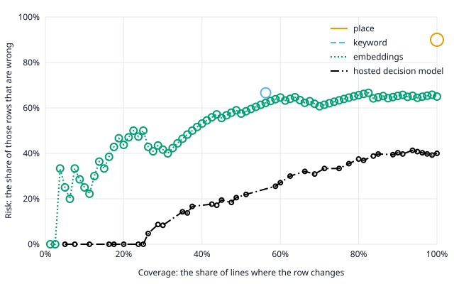

# Turn's evaluation

- **Run:** September 23, 2026, at commit `8ea25eb`.
- **Lines:** the 80 in `eval/lines.jsonl`.
- **Bank:** the app's own, `app/src/content/starter-bank.json`.
- **Models:** The hosted decision model, pinned to version 1.13.0 by
  `worker/wrangler.jsonc`, which answered as version 1.13.0 on all 320 calls;
  and Workers AI's `@cf/baai/bge-base-en-v1.5`, with `cls` pooling.

Each line is scored alone, from an empty row. The app picks its shortlist of 40:
up to 24 phrases that share a word with the line, then, since a fresh bank has
no taps, the place's first eight phrases in the bank's order, then the rest in
the bank's order. Each ranker orders those 40, and the row's rules turn its
ranking into what the user would see. The place's first eight phrases are always
among the 40, so the place ranker's top 1 and top 6 never depend on the line,
though which of its later phrases are among them can.

- **Rankers:** place gives the place's phrases in the bank's order; keyword, the
  phone's own ranking by shared words; embeddings, the cosine between the line
  and each phrase, with the phone's yes-or-no rule and no big button, showing no
  phrase below a cut-off that five-fold cross-validation sets; and hosted
  decision model, the relay's request as the hosted decision model answers it,
  which the row's rules take with their starting policy: a floor of 0.6, a big
  button above 0.85, and a margin of 0.15.
- **Ranking:** top 1 and top 6 count the lines with an acceptable phrase first
  or among the first six. A ranker ranks only the phrases it scores above 0, so
  keyword ranks none on a line that shares no word. Chance is a random order of
  the same phrases. The mean reciprocal rank is a mean of ranks, not a rate, so
  it has no interval.
- **The row:** coverage is the share of lines where the row changes, and risk
  the share of those rows that are wrong. Always holding is right on every line
  with no acceptable reply.
- **Intervals:** every rate carries its 95% Wilson interval. The hosted decision
  model minus embeddings in top 6 carries a 95% paired bootstrap interval, from
  9,999 resamples of the same lines drawn from a committed seed, and the hosted
  decision model trails only when the whole interval on all lines lies below
  zero; the subsets' intervals carry no verdict, since more intervals would make
  a false one likelier.
- **The hosted decision model's answers** vary a little from call to call, so
  each line is scored from the first of the three timed passes, and the big
  buttons come from all four answers, the warm-up included.

Contents:

1.  [Who wrote the data](#who-wrote-the-data)
1.  [All lines](#all-lines)
1.  [Yes-or-no lines](#yes-or-no-lines)
1.  [Pain and consent lines](#pain-and-consent-lines)
1.  [Lines that share no word with a reply](#lines-that-share-no-word-with-a-reply)
1.  [Big buttons on yes-or-no, pain, and consent lines](#big-buttons-on-yes-or-no-pain-and-consent-lines)
1.  [The question kind](#the-question-kind)
1.  [Risk and coverage](#risk-and-coverage)
1.  [The embeddings ranker's cut-offs](#the-embeddings-rankers-cut-offs)
1.  [Latency](#latency)

## Who wrote the data

- **These lines:** claude-a wrote 35, claude-b wrote 33, and claude-f wrote 12,
  and claude-c and claude-g labeled their acceptable replies.
- **The 80 lines, their labels, and the bank,** as the TRD's evaluation data
  records: at the team's direction, Claude subagents wrote the 80 lines and the
  starter bank on September 23, 2026. Two wrote 40 lines each from a brief that
  showed no phrase of the bank, as claude-a and claude-b; a third wrote the bank
  without seeing the lines, and a fourth read every phrase. Two more, claude-c
  and claude-d, then labeled every line's replies, each alone and from a brief
  that set no quota. Their labels left too few lines with no reply, so claude-f
  wrote 20 more lines meant to have none from a brief that showed no list of the
  bank's phrases, only the labeling rules, which name the fixed buttons and "I
  don't know"; of the 80 lines, it saw only the five that its first draft
  repeated, quoted back as situations to avoid. claude-g and claude-h labeled
  the new lines among the 80 by the same rules; 12 of them replaced lines with a
  reply, so that 16 lines have none. claude-c's labeling, with claude-g's for
  the new lines, is the one the evaluation scores. Text a language model wrote
  or labeled may suit a ranker built on one, and two labelings by one model show
  consistency rather than correctness. On that date, no teammate had yet read
  the bank or labeled a line, and no clinic had reviewed the bank.

## All lines

On the 80 lines in the file.

### Ranking on all lines

On the 64 with an acceptable phrase besides Yes, No, and Not sure:

| Ranker                | Top 1                        | Top 6                      | Mean reciprocal rank |
| --------------------- | ---------------------------- | -------------------------- | -------------------- |
| chance                | 5%                           | 26%                        | 0.15                 |
| place                 | 1 of 64, 1.6% (0.3% to 8.3%) | 8 of 64, 13% (6.5% to 23%) | 0.06                 |
| keyword               | 10 of 64, 16% (8.7% to 26%)  | 15 of 64, 23% (15% to 35%) | 0.19                 |
| embeddings            | 14 of 64, 22% (14% to 33%)   | 29 of 64, 45% (34% to 57%) | 0.34                 |
| hosted decision model | 43 of 64, 67% (55% to 77%)   | 48 of 64, 75% (63% to 84%) | 0.72                 |

The shortlist's recall at 40: 58 of 64, 91% (81% to 96%).

The hosted decision model minus embeddings in top 6: +29.7 points, with a 95%
paired interval of 17.2 to 42.2, so the hosted decision model leads embeddings.

### The row on all lines

| Ranker                | Right big button | Wrong big button | Right row | Wrong row | Missed reply | Right hold | Coverage                     | Risk                       |
| --------------------- | ---------------- | ---------------- | --------- | --------- | ------------ | ---------- | ---------------------------- | -------------------------- |
| always hold           | 0                | 0                | 0         | 0         | 64           | 16         | 0 of 80, 0% (0% to 4.6%)     | 0 of 0                     |
| place                 | 0                | 0                | 8         | 72        | 0            | 0          | 80 of 80, 100% (95% to 100%) | 72 of 80, 90% (81% to 95%) |
| keyword               | 0                | 0                | 17        | 33        | 25           | 5          | 50 of 80, 63% (52% to 72%)   | 33 of 50, 66% (52% to 78%) |
| embeddings            | 0                | 0                | 31        | 48        | 1            | 0          | 79 of 80, 99% (93% to 100%)  | 48 of 79, 61% (50% to 71%) |
| hosted decision model | 4                | 0                | 49        | 15        | 6            | 6          | 68 of 80, 85% (76% to 91%)   | 15 of 68, 22% (14% to 33%) |

## Yes-or-no lines

On the 37 lines that their writer marked yes-or-no.

### Ranking on yes-or-no lines

On the 37 with an acceptable phrase besides Yes, No, and Not sure:

| Ranker                | Top 1                       | Top 6                      | Mean reciprocal rank |
| --------------------- | --------------------------- | -------------------------- | -------------------- |
| chance                | 6.1%                        | 30%                        | 0.17                 |
| place                 | 1 of 37, 2.7% (0.5% to 14%) | 6 of 37, 16% (7.7% to 31%) | 0.07                 |
| keyword               | 7 of 37, 19% (9.5% to 34%)  | 9 of 37, 24% (13% to 40%)  | 0.22                 |
| embeddings            | 9 of 37, 24% (13% to 40%)   | 15 of 37, 41% (26% to 57%) | 0.34                 |
| hosted decision model | 25 of 37, 68% (51% to 80%)  | 26 of 37, 70% (54% to 83%) | 0.70                 |

The shortlist's recall at 40: 32 of 37, 86% (72% to 94%).

The hosted decision model minus embeddings in top 6: +29.7 points, with a 95%
paired interval of 13.5 to 45.9.

### The row on yes-or-no lines

| Ranker                | Right big button | Wrong big button | Right row | Wrong row | Missed reply | Right hold | Coverage                     | Risk                       |
| --------------------- | ---------------- | ---------------- | --------- | --------- | ------------ | ---------- | ---------------------------- | -------------------------- |
| always hold           | 0                | 0                | 0         | 0         | 37           | 0          | 0 of 37, 0% (0% to 9.4%)     | 0 of 0                     |
| place                 | 0                | 0                | 6         | 31        | 0            | 0          | 37 of 37, 100% (91% to 100%) | 31 of 37, 84% (69% to 92%) |
| keyword               | 0                | 0                | 11        | 10        | 16           | 0          | 21 of 37, 57% (41% to 71%)   | 10 of 21, 48% (28% to 68%) |
| embeddings            | 0                | 0                | 18        | 19        | 0            | 0          | 37 of 37, 100% (91% to 100%) | 19 of 37, 51% (36% to 67%) |
| hosted decision model | 0                | 0                | 37        | 0         | 0            | 0          | 37 of 37, 100% (91% to 100%) | 0 of 37, 0% (0% to 9.4%)   |

## Pain and consent lines

On the 17 lines about pain or asking for consent, which EVAL-5 names.

### Ranking on pain and consent lines

On the 17 with an acceptable phrase besides Yes, No, and Not sure:

| Ranker                | Top 1                      | Top 6                      | Mean reciprocal rank |
| --------------------- | -------------------------- | -------------------------- | -------------------- |
| chance                | 8.8%                       | 41%                        | 0.23                 |
| place                 | 0 of 17, 0% (0% to 18%)    | 2 of 17, 12% (3.3% to 34%) | 0.04                 |
| keyword               | 2 of 17, 12% (3.3% to 34%) | 5 of 17, 29% (13% to 53%)  | 0.19                 |
| embeddings            | 4 of 17, 24% (9.6% to 47%) | 10 of 17, 59% (36% to 78%) | 0.40                 |
| hosted decision model | 13 of 17, 76% (53% to 90%) | 13 of 17, 76% (53% to 90%) | 0.78                 |

The shortlist's recall at 40: 16 of 17, 94% (73% to 99%).

The hosted decision model minus embeddings in top 6: +17.6 points, with a 95%
paired interval of -5.9 to 41.2.

### The row on pain and consent lines

| Ranker                | Right big button | Wrong big button | Right row | Wrong row | Missed reply | Right hold | Coverage                     | Risk                       |
| --------------------- | ---------------- | ---------------- | --------- | --------- | ------------ | ---------- | ---------------------------- | -------------------------- |
| always hold           | 0                | 0                | 0         | 0         | 17           | 0          | 0 of 17, 0% (0% to 18%)      | 0 of 0                     |
| place                 | 0                | 0                | 2         | 15        | 0            | 0          | 17 of 17, 100% (82% to 100%) | 15 of 17, 88% (66% to 97%) |
| keyword               | 0                | 0                | 5         | 5         | 7            | 0          | 10 of 17, 59% (36% to 78%)   | 5 of 10, 50% (24% to 76%)  |
| embeddings            | 0                | 0                | 10        | 7         | 0            | 0          | 17 of 17, 100% (82% to 100%) | 7 of 17, 41% (22% to 64%)  |
| hosted decision model | 0                | 0                | 17        | 0         | 0            | 0          | 17 of 17, 100% (82% to 100%) | 0 of 17, 0% (0% to 18%)    |

## Lines that share no word with a reply

On the 49 lines that share no word with an acceptable reply, as the phone
matches words.

### Ranking on lines that share no word with a reply

On the 49 with an acceptable phrase besides Yes, No, and Not sure:

| Ranker                | Top 1                       | Top 6                      | Mean reciprocal rank |
| --------------------- | --------------------------- | -------------------------- | -------------------- |
| chance                | 4.3%                        | 23%                        | 0.14                 |
| place                 | 1 of 49, 2% (0.4% to 11%)   | 6 of 49, 12% (5.7% to 24%) | 0.05                 |
| keyword               | 0 of 49, 0% (0% to 7.3%)    | 0 of 49, 0% (0% to 7.3%)   | 0.00                 |
| embeddings            | 4 of 49, 8.2% (3.2% to 19%) | 15 of 49, 31% (20% to 45%) | 0.20                 |
| hosted decision model | 29 of 49, 59% (45% to 72%)  | 34 of 49, 69% (55% to 80%) | 0.65                 |

The shortlist's recall at 40: 43 of 49, 88% (76% to 94%).

The hosted decision model minus embeddings in top 6: +38.8 points, with a 95%
paired interval of 24.5 to 53.1.

### The row on lines that share no word with a reply

| Ranker                | Right big button | Wrong big button | Right row | Wrong row | Missed reply | Right hold | Coverage                     | Risk                       |
| --------------------- | ---------------- | ---------------- | --------- | --------- | ------------ | ---------- | ---------------------------- | -------------------------- |
| always hold           | 0                | 0                | 0         | 0         | 49           | 0          | 0 of 49, 0% (0% to 7.3%)     | 0 of 0                     |
| place                 | 0                | 0                | 6         | 43        | 0            | 0          | 49 of 49, 100% (93% to 100%) | 43 of 49, 88% (76% to 94%) |
| keyword               | 0                | 0                | 2         | 22        | 25           | 0          | 24 of 49, 49% (36% to 63%)   | 22 of 24, 92% (74% to 98%) |
| embeddings            | 0                | 0                | 16        | 32        | 1            | 0          | 48 of 49, 98% (89% to 100%)  | 32 of 48, 67% (53% to 78%) |
| hosted decision model | 1                | 0                | 38        | 5         | 5            | 0          | 44 of 49, 90% (78% to 96%)   | 5 of 44, 11% (5% to 24%)   |

## Big buttons on yes-or-no, pain, and consent lines

Every big button a ranker showed on a line its writer marked yes-or-no, or on
one about pain or consent, in any of its answers (EVAL-5): 1, 0 of them wrong.

| Ranker                | Line    | The partner said                                         | Big button    | Right or wrong | Answers |
| --------------------- | ------- | -------------------------------------------------------- | ------------- | -------------- | ------- |
| hosted decision model | line-05 | Let me get your blood pressure before we start, alright? | Yes, go ahead | right          | 1 of 4  |

## The question kind

The hosted decision model's most likely kind of question against its writer's,
on all 80 lines: right on 80 of 80, 100% (95% to 100%). Each row is the writer's
kind, and each column the hosted decision model's, or a tie when two kinds share
the top.

| Writer's kind  | Yes or no | Either or | Open | Not a question | Tie |
| -------------- | --------- | --------- | ---- | -------------- | --- |
| Yes or no      | 37        | 0         | 0    | 0              | 0   |
| Either or      | 0         | 12        | 0    | 0              | 0   |
| Open           | 0         | 0         | 16   | 0              | 0   |
| Not a question | 0         | 0         | 0    | 15             | 0   |

## Risk and coverage

Each ranker's risk against its coverage on all 80 lines, as its threshold falls
through its top scores: a line is covered when its top phrase reaches the
threshold, and right when one of its first six phrases at or above it is
acceptable; the fixed buttons and the big button don't count. place and keyword
score each phrase 1 or 0, so each makes one point. The table gives the risk at
the first point that covers at least each share of the lines, and at what
coverage.

| Ranker                | 20%         | 40%         | 60%         | 80%         | 100%        |
| --------------------- | ----------- | ----------- | ----------- | ----------- | ----------- |
| place                 | 90% at 100% | 90% at 100% | 90% at 100% | 90% at 100% | 90% at 100% |
| keyword               | 67% at 56%  | 67% at 56%  | never       | never       | never       |
| embeddings            | 44% at 20%  | 53% at 40%  | 65% at 60%  | 66% at 80%  | 65% at 100% |
| hosted decision model | 0% at 20%   | 18% at 43%  | 27% at 60%  | 38% at 80%  | 40% at 100% |

## The embeddings ranker's cut-offs

The lines went into five folds, from one seeded shuffle, each with its share of
the lines with no acceptable reply. Each fold's lines were scored at the
cut-off, of the six highest cosines of each of the other four folds' lines, that
made the most of those lines right, a tie going to the higher. A line whose top
phrase falls short of its cut-off shows no phrase: the row holds, unless the
phone's yes-or-no rule brings the fixed buttons. Folds 1 to 5: 0.469 for 16
lines, 0.469 for 16 lines, 0.469 for 16 lines, 0.469 for 16 lines, and 0.502 for
16 lines.

## Latency

Milliseconds per line over three passes, after a warm-up pass: the app picking
the shortlist, then each ranker's ranking, its network trip included.

| Step                  | Median  | 95th percentile | Maximum  |
| --------------------- | ------- | --------------- | -------- |
| shortlist             | 0.320   | 0.442           | 0.577    |
| place                 | 0.055   | 0.072           | 0.101    |
| keyword               | 0.132   | 0.204           | 0.330    |
| embeddings            | 228.995 | 967.687         | 3452.183 |
| hosted decision model | 777.284 | 1898.665        | 5623.752 |
